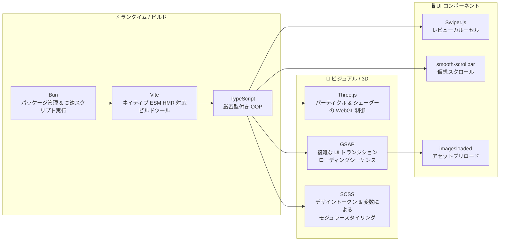
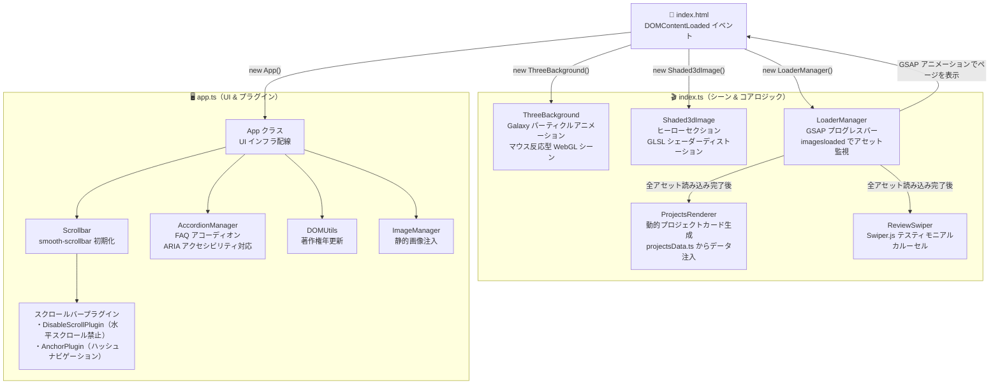
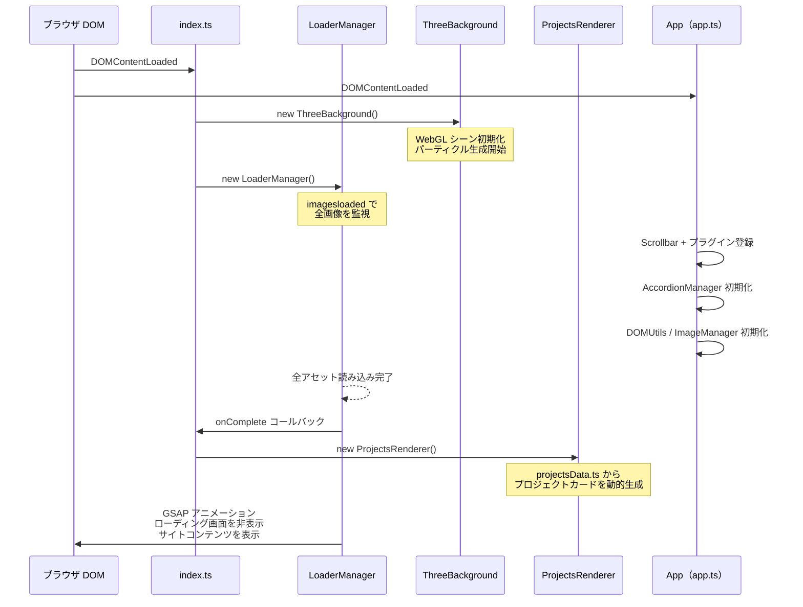
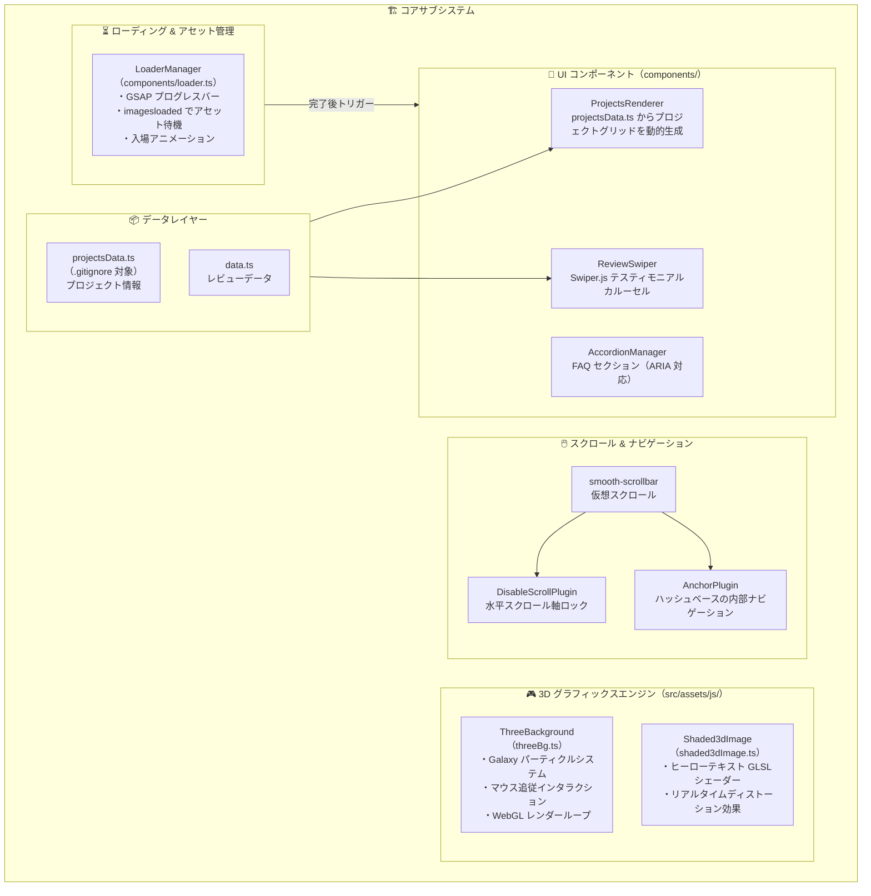

# 概要

**関連ソースファイル**: `CLAUDE.md` / `GEMINI.md` / `README.md` / `package.json` / `src/index.html` / `src/assets/js/config.ts`

**personal-portfolio** プロジェクトは、没入感のある 3D ユーザー体験を通じてプロフェッショナルな実績を紹介するために設計された、モダンでレスポンシブな Web アプリケーションです。高パフォーマンスなアニメーションとクリエイティブコーディングに重点を置いて構築されており、重厚なフレームワークを採用せず、直接的な DOM 操作とカスタム WebGL 実装を活用した **"Vanilla" TypeScript アーキテクチャ**を採用しています。

各サブシステムの詳細については以下を参照してください。

- 開発環境のセットアップ → [Getting Started]
- ディレクトリ構成 → [Project Structure]
- アーキテクチャ詳細 → [Application Architecture]
- 3D グラフィックス → [3D Graphics Engine]
- セキュリティ → [Security & Utilities]

---

## 目的とコア体験

ポートフォリオは、ユーザーをいくつかのテーマセクションに案内するシングルページ体験として構成されています。

- **没入型 3D バックグラウンド**: マウスの動きに反応するプロシージャルなパーティクルシステム（`src/assets/js/threeBg.ts`）
- **インタラクティブなヒーローセクション**: リアルタイム GLSL シェーダーディストーションを特徴とする高インパクトなタイポグラフィ（`src/assets/js/shaded3dImage.ts`）
- **ダイナミックコンテンツ注入**: プロジェクトとレビューデータを TypeScript モジュールから動的にレンダリング。手動 HTML 編集なしで簡単なコンテンツ管理を実現（`src/assets/js/components/projectsRenderer.ts`）
- **スムーズなナビゲーション**: サイトの "クリエイティブ" な雰囲気を高める仮想スクロールとカスタムカーソル動作（`src/assets/js/app.ts:30-45`）

---

## 技術スタック



| カテゴリ | 技術 | 役割 |
|---------|------|------|
| **ランタイム** | Bun | パッケージ管理と高速スクリプト実行 |
| **言語** | TypeScript | 厳密型付きオブジェクト指向プログラミング |
| **バンドラー** | Vite | ネイティブ ESM HMR 対応の次世代ビルドツール |
| **3D エンジン** | Three.js | パーティクルとシェーダーの WebGL 制御 |
| **アニメーション** | GSAP | 複雑な UI トランジションとローディングシーケンスの制御 |
| **スタイリング** | SCSS | デザイントークンと変数によるモジュラースタイリング |

---

## ハイレベルアーキテクチャ

アプリケーションは**モジュラーなクラスベースアーキテクチャ**に従っています。エントリーポイントは 3D 環境と UI レイヤーを同時にブートストラップし、ローディング画面からインタラクティブなサイトへのシームレスな遷移を保証します。

### システムエントリーポイント

プロジェクトは**デュアルエントリー初期化戦略**を採用しています。

1. **`index.ts`**: Three.js ライフサイクルと高レベルのコンポーネントオーケストレーションを処理（`src/index.ts:1-20`）
2. **`App (app.ts)`**: DOM ベースの UI レイヤー・スクロールプラグイン・汎用ユーティリティを管理（`src/assets/js/app.ts:10-25`）

### システム初期化フロー



### コンポーネント通信図

`LoaderManager` はプライマリオーケストレーターとして機能し、すべてのアセット（画像とシェーダー）の準備が整うまで UI の表示を制御します。



---

## コアサブシステム



| サブシステム | 主なクラス / ファイル | 責務 |
|------------|------------------|------|
| **3D エンジン** | `ThreeBackground` | Galaxy パーティクルアニメーションとシェーダー管理 |
| **ローディング** | `LoaderManager` | プログレスバー・アセットプリロード・入場アニメーション |
| **スクロール** | `Scrollbar` | スムーズスクロールとハッシュナビゲーションプラグイン |
| **UI レンダリング** | `ProjectsRenderer` | データからのプロジェクトカードの動的注入 |
| **ユーティリティ** | `DOMUtils` / `ImageManager` | 著作権更新と静的画像注入 |

---

## ナビゲーションとセットアップ

このコードベースの詳細な技術情報については以下のページを参照してください。

- **[Getting Started]**: `bun run dev` を使用した開発環境のセットアップ・開発サーバーの起動・プロダクションビルドのステップバイステップガイド
- **[Project Structure]**: `src/`（処理済みアセット）と `public/`（`/avatars/`・`/projects/` などの静的アセット）の違いを含むディレクトリレイアウトの説明

---

## プロジェクトディレクトリ構成

```
personal-portfolio/
├── src/
│   ├── index.html                    # メイン HTML テンプレート
│   ├── index.ts                      # ⭐ エントリーポイント（シーン & コアロジック）
│   └── assets/
│       ├── js/
│       │   ├── app.ts                # App クラス（UI & プラグイン）
│       │   ├── threeBg.ts            # ThreeBackground（パーティクル WebGL）
│       │   ├── shaded3dImage.ts      # Shaded3dImage（GLSL シェーダー）
│       │   ├── config.ts             # デザイントークン & 設定
│       │   ├── components/
│       │   │   ├── loader.ts         # LoaderManager（ローディング制御）
│       │   │   ├── projectsRenderer.ts  # 動的プロジェクトカード生成
│       │   │   ├── reviewSwiper.ts   # Swiper.js カルーセル
│       │   │   └── accordion.ts      # FAQ アコーディオン
│       │   ├── plugins/
│       │   │   └── scrollbarPlugins.ts  # smooth-scrollbar プラグイン
│       │   ├── data/
│       │   │   ├── projectsData.ts   # プロジェクトデータ（gitignore 対象）
│       │   │   └── data.ts           # レビューデータ
│       │   └── utils/
│       │       ├── url.ts            # URL サニタイズ
│       │       └── domUtils.ts       # DOM ユーティリティ
│       └── scss/                     # SCSS スタイル（デザイントークン）
├── public/
│   ├── projects/                     # プロジェクトサムネイル画像（WebP / PNG）
│   └── avatars/                      # アバター画像
├── package.json                      # 依存関係とスクリプト
├── vite.config.ts                    # Vite ビルド設定
├── tsconfig.json                     # TypeScript 設定
├── CLAUDE.md                         # Claude Code 設定
└── GEMINI.md                         # Gemini AI 設定
```
